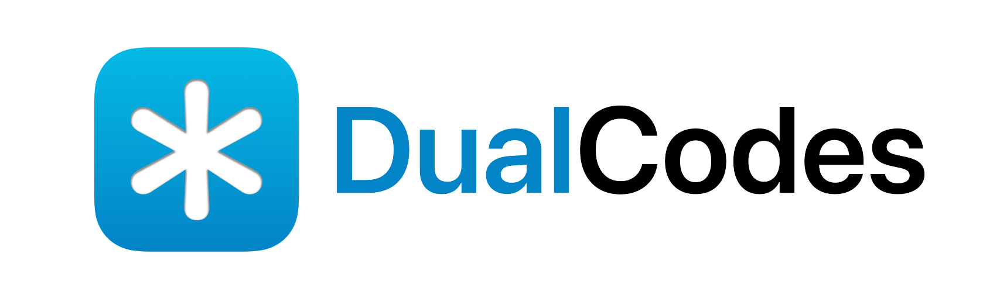

**Advanced 2FA Security Solution, Right in Your Browser**

---

## What is DualCodes?
DualCodes is a 2-factor authenticator app for people with advanced account security requirements. DualCodes can be fired up on any device with a modern browser, giving you complete control of your account security data.

[Live Demo](https://dualcodes-demo.pages.dev/)

## Why DualCodes?
- **Convenience.** No app required, just in your any devices with a modern browser.
- **Secure.** Sync across multiple devices with the server or NAS you own with AES-GCM end-to-end encryption.
- **Fully control.** You can also make your security secrets fully offline with the export and import feature.
- **Offline friendly.** You can launch DualCodes without a network once you launch it on your browser.

## How to Deploy DualCodes?
It’s really easy to deploy DualCodes with Docker Compose.

```yaml
version: '3'
services:
  dualcodes:
    image: astrian/dualcodes:latest
    environment:
      - CALL_PWD=<your-syncing-password>
    ports:
      - 9999:80
    volumes:
      - ./app:/opt/app/packages/backend/db
    working_dir: /opt/app/packages/backend/db
```

After Docker prompts that the project has already launched, reverse proxy the port `9999` (or your custom port) to your domain and 443 port. We recommended configuring HTTPS for DualCodes so it can use your device’s camera to scan QR codes and improve security.

## Contribute to DualCodes
DualCodes is currently in an active development sequence, so please monitor the data backup. You can also contribute to DualCodes by fork, modify codes, and create a pull request for us!

## License
MIT